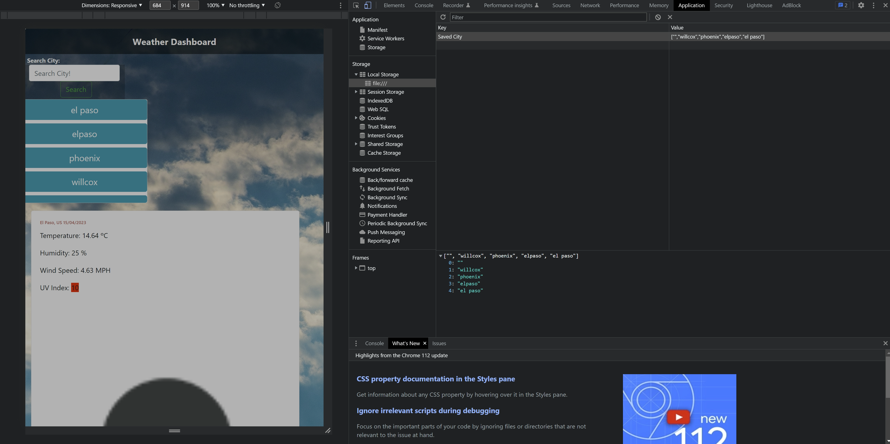

# 06-Weather Dashboard App

```
An application that provides weather information for any city, 
including details such as temperature, humidity, wind speed, and UV index, 
using the OpenWeather API.
```

<h2>The challange </h2>

```
The challenge is to build a weather dashboard that will run in the browser 
and feature dynamically updated HTML and CSS.
```

## User Story

```
S A traveler
I WANT to see the weather outlook for multiple cities
SO THAT I can plan a trip accordingly
```

## Acceptance Criteria

```
GIVEN a weather dashboard with form inputs
WHEN I search for a city
THEN I am presented with current and future conditions for that city and that city is added to the search history
WHEN I view current weather conditions for that city
THEN I am presented with the city name, the date, an icon representation of weather conditions, the temperature, the humidity, and the the wind speed
WHEN I view future weather conditions for that city
THEN I am presented with a 5-day forecast that displays the date, an icon representation of weather conditions, the temperature, the wind speed, and the humidity
WHEN I click on a city in the search history
THEN I am again presented with current and future conditions for that city
```

## Mock-Up:



## The Resources I used:

- https://openweathermap.org/

## Links to the challange
<br>
The challange was upload to Github at the following repository: https://github.com/TacoCodes/weather-dashboard
<br>

deployed github page for weather app: https://tacocodes.github.io/weather-dashboard/

